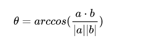

# webot-path-plan-course-design
course design on webot

[toc]

 

# 1.系统概述

本系统在webot仿真平台上搭建虚拟环境，并设置障碍物，用简易的四轮小车实现目标识别、定位、避障、路径规划等功能，达到与智能机器人的交互目的。目标识别利用平台自带的相机识别平台中的物体，算法实现了逐步骤分析，最终到达目标点的功能。

# 系统功能分析

### 2.1目标检测

为了实现对于路径上障碍物位置和类别的识别，我们在机器人的children上添加camera控件，对相机参数进行设置，激活相机本身的目标识别模块，小车运动时，相机会拍摄视频，视频中可以自动识别出目标，并将其用红框表示出来，通过传感器还可以知道到达物体的距离。

 

 

### 2.2运动控制

为了使用最简单的设备实现要求的功能，我们使用简单搭建的四轮小车，在小车头部配备两个传感器，再在头部和尾部分别搭载一个GPS。由于设备简单，我们能够对小车进行的控制只有轮子的速度，为了使车子正常，我们将左右轮子各自前后轮的速度绑定，所以我们能够控制的只有左右轮子的速度。

 

因为只知道左右轮子的速度，所以这带来了一个关键的问题，那就是我们只能通过左右轮子速度相同使车子前进或者后退，速度不同，则进行左转或者右转。同时还有一个关键的问题，小车连它的前方是什么方向都不知道。受人启发，我们使用头尾都搭载GPS的方式。

#### **双GPS确定方向**

目的导向，最终我们要到达目的地，我们可以给出目标点的位置，加上车头，车尾的GPS，我们有3点的坐标，将目标点和车头GPS分别与车尾GPS作差，得到两个向量，利用两个向量，我们可以得到：

***\*夹角：\****

 

向量内积确定角的大小，实际使用时我们知道cos的值就足够了。

***\*与目标点相关的方向：\****

 

向量外积确定向量方向关系，计算xa*zb-xb*za,再根据其正负，我们可以知道车子方向与目标方向是锐角还是顿角，我们认为如果是钝角我们应该转另外一个方向。

### ***\*2.3路径规划\****

在解决这个问题之前，我们发现有两种路可走，其原因在于我们在代码中没法获取仿真环境中的物体，所以没办法实时获取仿真环境，于是对于路径规划，我们分为了，已经环境的静态的路径规划，这种方法是记录当前环境后可以使用A*等各种算法，但一旦仿真环境改变就行不通，另一种方法是根据小车能够感受到的环境做出策略，逐步靠近我们的目标点，这也是我们采用的方法。

我们的思路就是，当与目标点的夹角大于某个值时就转动方向，让其小于这个threshold，而当遇到障碍时，我们就转动方向，且为了防止震荡，我们选择在遇到障碍物的转向中，我们使其再走50个时间点，期间如果遇到障碍物就从以上步骤再次开始，于是我们就实现了动态的规划。

 

# 注意

本次设计中，我们实现了webot中的小车的目标识别与路径规划，适用于环境全局未知的情形，对于多种复杂的环境都能够避障并最终到达目标点，但类似贪婪算法，受限于环境未知，我们路径规划时没有办法长远考虑，我们实现了一个某些局部能够实现良好，但全局来说不确定因素多的路径规划。

# others

代码更新后解决了与目标点成180的方向时会出现的左右震荡，但因为是四轮车会有侧面卡墙的情况，可在左右两边添加传感器，但课设已经结束不再考虑了。
